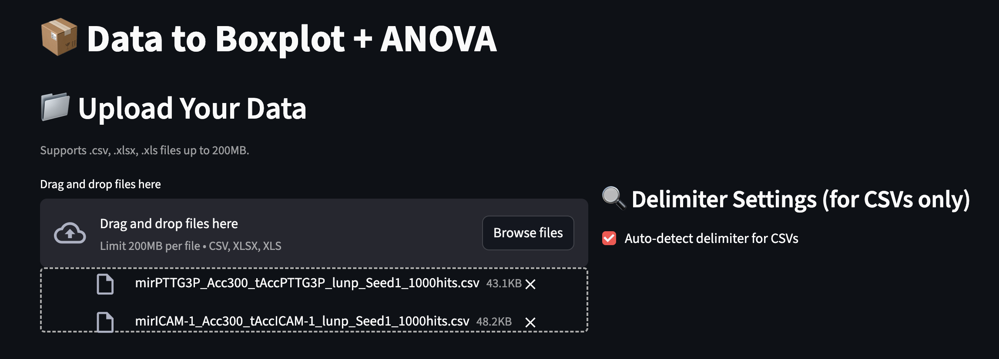
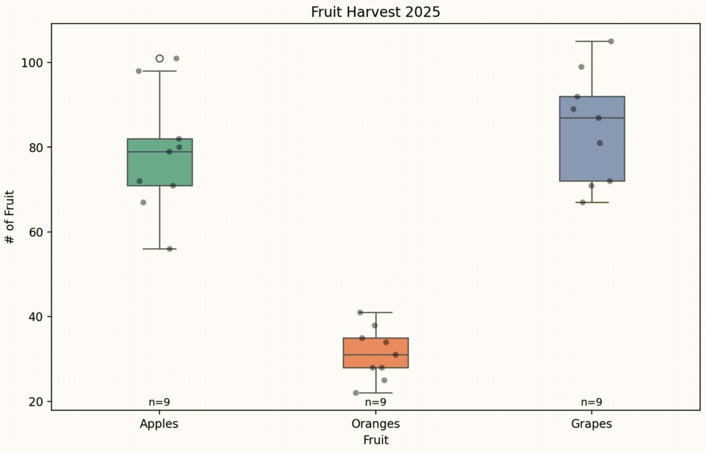
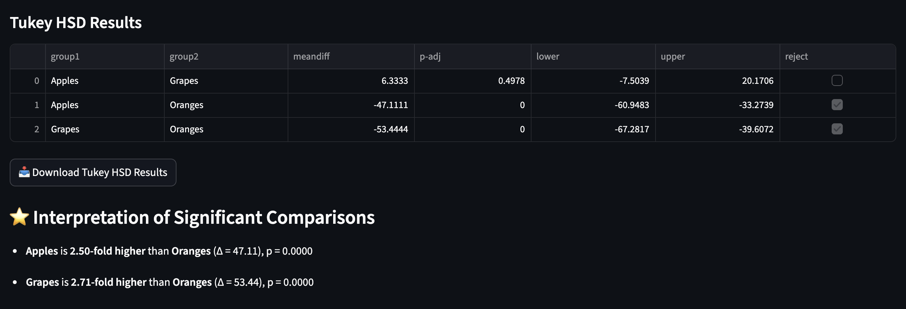

# 📦 data2boxplot

**data2boxplot** is a lightweight, powerful web app that instantly transforms CSV data into publication-quality boxplots — complete with ANOVA and Tukey HSD analysis. No coding required.
🧪 Built with Python, Streamlit, pandas, seaborn, and statsmodels.

---

## 🌐 Website

➡️ Try it live: [https://data2boxplot.com](https://data2boxplot.com)  

---

## ✨ Features

- 🔼 Upload CSV or Excel files directly
- 📊 Generate clean, customizable boxplots instantly
- 📈 Add violin plots, scatter points, and group means
- 🧠 One-way ANOVA + post hoc Tukey HSD
- ✅ Clear natural-language interpretations of results
- 📤 Downloadable Tukey tables
- 📦 No installation or coding needed — just drop your file

---

## 📷 Screenshots

| Upload your file |
|------------------|
|  |

| Boxplot Output & Violin |
|----------------|
|  |

| Tukey HSD & Signifigance |
|-----------|
 |


---

## 📚 How It Works

1. **Upload** a CSV or Excel file.
2. **Choose** a numerical column to plot, and a grouping column.
3. **Customize** options — like adding scatter points or violin overlays.
4. **Analyze** using ANOVA (auto-detected p-values), and if significant...
5. **Interpret** clear summaries with post hoc Tukey HSD.
6. **Download** your results in one click.

---

## 💡 Why I Built This

As a neuroscience undergrad doing biomedical research, I constantly needed fast, clean visuals for small group comparisons — especially with boxplots and ANOVA. Most tools were clunky, overkill, or required code.

**data2boxplot** was built for speed, clarity, and accessibility — for students, researchers, and educators alike.

---

## 🚀 Tech Stack

- [Streamlit](https://streamlit.io/)
- [pandas](https://pandas.pydata.org/)
- [matplotlib](https://matplotlib.org/)
- [seaborn](https://seaborn.pydata.org/)
- [statsmodels](https://www.statsmodels.org/)
- Python 3.10+

---

## 🛠️ Local Setup

```bash
git clone https://github.com/rsmith3rd/data2boxplot.git
cd data2boxplot
pip install -r requirements.txt
streamlit run data2boxplot.py
